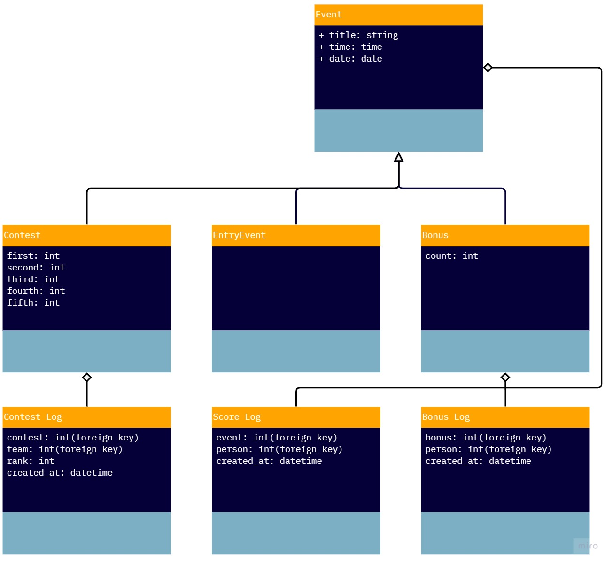
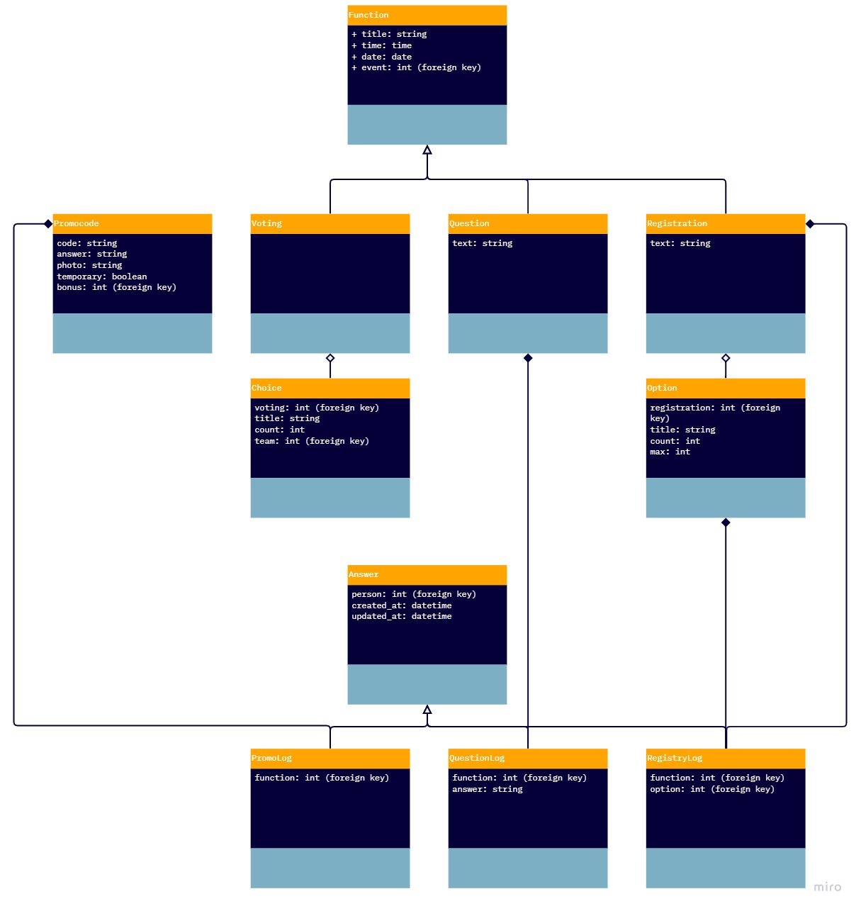
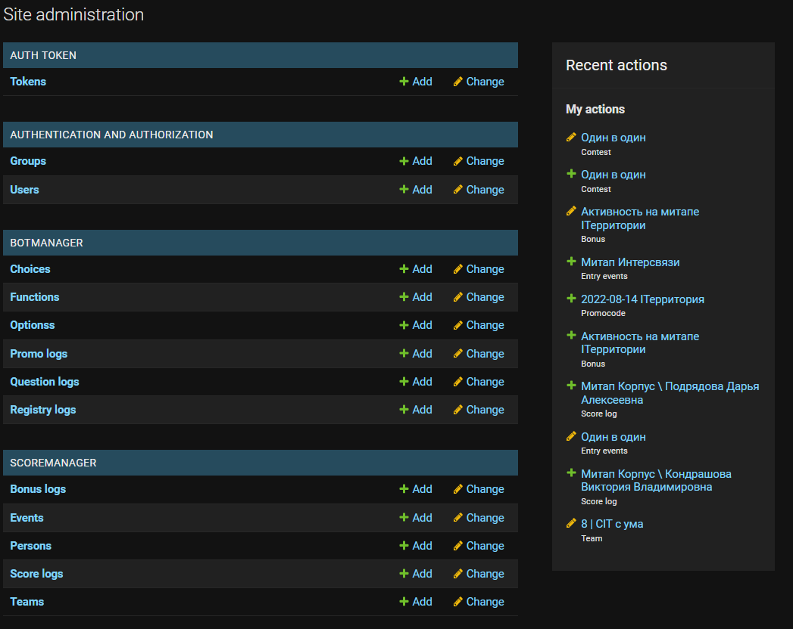
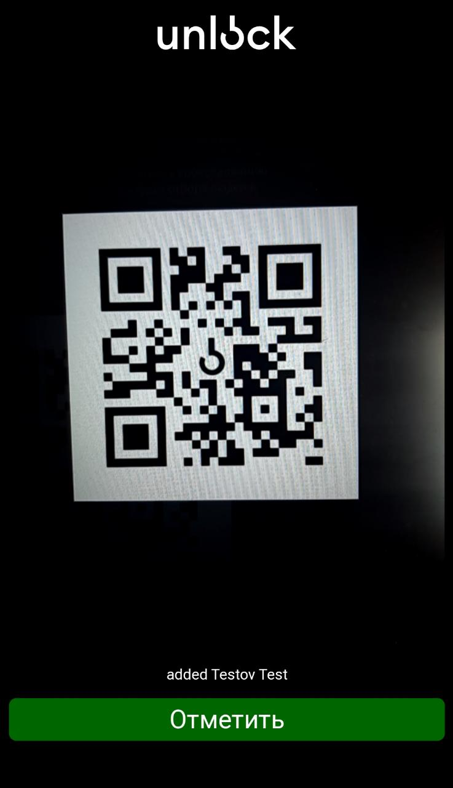
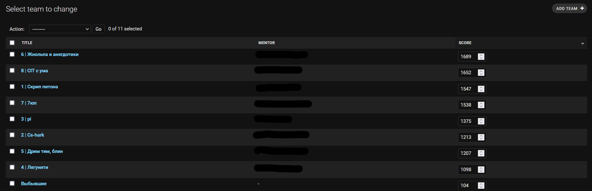

# Unlock-system
This system was used to monitor activity, attendance, and scores of the participants at the summer camp of educational project [Unlock](https://vk.com/unlock_shift)

### Table of contents
* [Technologies and Skills](#technologies_and_skills)
* [Structure](#structure)
* [Functionality](#functionality)

## Technologies and Skills

The stack that was used:
* Django
* Django Restful Framework 
* Vue.js

During development the following skills were used and improved:
1. RESTful API design
2. Databases design
3. Working with high load
4. Implementing third party JS libraries
5. Rapid maintenance and bug fixing

## Structure

The projects consents of two applications

### Score Manager
Which managed data of participants, teams, and their scores

### Bot Manager
Which managed the interaction between the backend and the chatbot 

## Functionality
### Admin Panel
Through this panel, organizers could create events and activities, distribute points, and get real time look at data.

### QR Scanner 
To create a convenient way to keep count of active participants, a QR scanner was added to the system. 

#### How does it work: 
1. Admin sends a link that contains id of an event `/qr/scan/{id:int}`
2. Organizers scan the personal QR code of the participants
3. A log is created and saved in the database
4. The user gets notified about who he scanned

### Chat Bot Functions

Every participant has access to telegram bot [Sherlock](https://github.com/SumJest/unlockbot), which has the following functions:
1. Asking questions
2. Sending polls 
3. Sending registrations
4. Activating promo codes
The answers and results of the functions above is saved in the database, and available for review by admins later. 

Such functions are generated on the backend for further requests from the [chatbot](https://github.com/SumJest/unlockbot)

### Score Monitoring

After every event or activity, points are added accordingly to participants and teams, this information is updated in real time, and can be viewed by admins 

